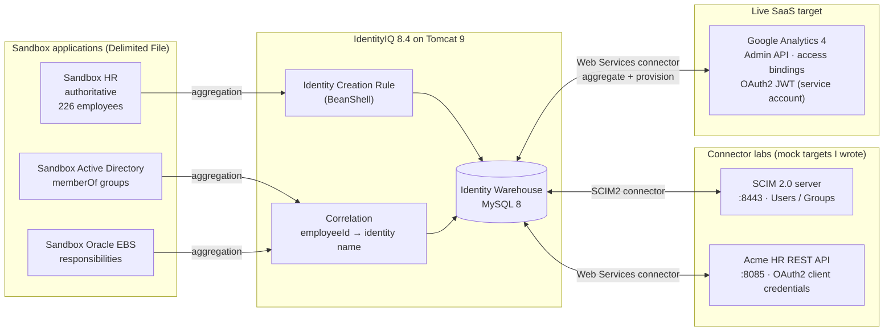

# IIQ Sandbox Lab

A local **SailPoint IdentityIQ 8.4** environment I built to practice end-to-end identity governance work:
authoritative-source onboarding, correlation, identity creation rules, entitlement aggregation, and
connector onboarding against mock SCIM 2.0 and OAuth2 REST APIs I wrote, and a **live SaaS integration**:
request-driven provisioning to Google Analytics through its Admin API.

**Stack:** IdentityIQ 8.4 · Tomcat 9 · MySQL 8.0 · Java 17 (Temurin) · SailPoint SSB for builds/deploys ·
PowerShell automation · Python (FastAPI and stdlib) mock targets

## Architecture



## What's here

| Path | What it is |
|---|---|
| [`setup/setup-iiq-sandbox.ps1`](setup/setup-iiq-sandbox.ps1) | One-shot, re-runnable install: downloads JDK 17, Tomcat 9, and MySQL 8, configures them, builds the WAR with SSB, creates the schema, deploys, and imports init objects |
| [`setup/load-sandbox-data.ps1`](setup/load-sandbox-data.ps1) | Imports the sandbox objects in dependency order, then runs HR → AD → EBS aggregation and an identity refresh |
| [`config/`](config) | IIQ XML objects: 3 applications, correlation config, identity creation rule, aggregation and refresh tasks |
| [`sandbox-data/`](sandbox-data) | Synthetic feeds: an HR roster with a manager hierarchy, AD accounts with group memberships, EBS users with responsibilities |
| [`labs/scim/`](labs/scim) | Standard-library-only **SCIM 2.0 server** (Users, Groups, paging, Bearer/Basic auth, request log), seeded from the HR feed, used to test the IIQ SCIM2 connector |
| [`docs/google-analytics/`](docs/google-analytics) | **Google Analytics connector**: [technical reference](docs/google-analytics/TECHNICAL.md) and [step-by-step rebuild guide](docs/google-analytics/STEP-BY-STEP.md) (both also as PDF). The config is under `config/` (`GoogleAnalytics.xml`, the Build Access Binding rule, correlation, and the aggregation task). |
| [`labs/web-services/`](labs/web-services) | **FastAPI "Acme HR" REST API** with OAuth2 client credentials, paging, nested JSON, and role objects, plus starter rules and a full [lab guide](labs/web-services/LAB_GUIDE.md) for onboarding it with the Web Services connector |

## Design notes

- **HR is authoritative.** Its creation rule names each identity by `employeeId` and sets the manager link,
  department, title, location, and employee type. Terminated employees are marked inactive.
- **AD and EBS correlate on `employeeId`.** A single shared `CorrelationConfig` maps the account attribute to the
  identity name, so no correlation rule code is needed.
- **Multi-row feeds.** AD and EBS export one row per group or responsibility. `mergeRows` plus `indexColumn` folds
  them into one account with a multi-valued entitlement attribute (`memberOf`, `responsibility`), marked
  managed so it lands in the Entitlement Catalog.
- **Load order matters.** Rules and correlation config are imported before the applications that reference them,
  and HR is aggregated first so identities exist before AD and EBS try to correlate.
- **Google Analytics: merge-then-patch.** GA's `PATCH accessBinding` replaces the whole role list, but an IIQ
  plan only carries the change. A Before Operation rule merges the change into the account's current roles,
  always sends the full list, and switches to `DELETE` when the last role is removed. It was tested live:
  create → add role → remove role → remove last role.
- **The mocks seed realistic problems on purpose:** mixed-case logins, a service account with no employee ID
  (orphan), suspended users, and an optional "hard mode" where roles have to be fetched with a child operation.

## Running it

```powershell
# One-time install (needs an SSB project that contains the IIQ 8.4 GA zip from Compass)
.\setup\setup-iiq-sandbox.ps1 -Repo C:\path\to\IdentityIQ-SSB
.\setup\load-sandbox-data.ps1

# Daily start: MySQL, then Tomcat (IIQ takes a few minutes to come up)
Start-Process C:\IIQSandbox\mysql\bin\mysqld.exe -ArgumentList '--defaults-file="C:\IIQSandbox\mysql\my.ini"' -WindowStyle Hidden
C:\IIQSandbox\tomcat\bin\startup.bat
# http://localhost:8080/identityiq

# Connector lab targets
.\labs\scim\start-scim.ps1                                      # SCIM 2.0 on :8443
cd labs\web-services; uvicorn mock_api:app --port 8085           # REST API on :8085 (docs at /docs)
```

SailPoint software and SSB are licensed through SailPoint Compass and are **not** included in this repo.

## Status

- [x] Sandbox install automation and demo data
- [x] HR / AD / EBS onboarding with creation rule and correlation
- [x] Mock SCIM 2.0 and REST targets
- [x] Google Analytics (live GA4 Admin API): aggregation, correlation, and LCM provisioning, with docs
- [ ] Web Services connector: aggregation, rules, and provisioning ([lab guide](labs/web-services/LAB_GUIDE.md))
- [ ] Break/fix troubleshooting runbook
- [ ] Screenshots
